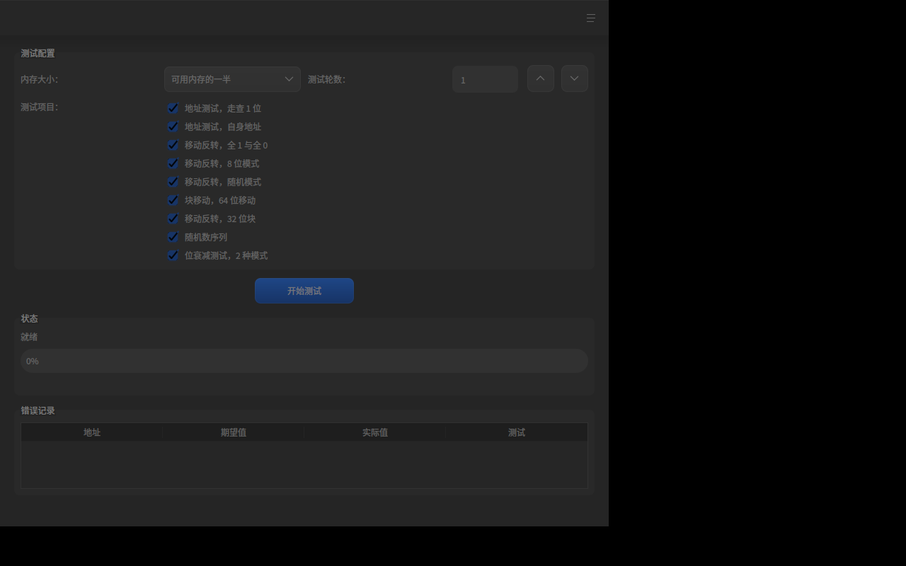
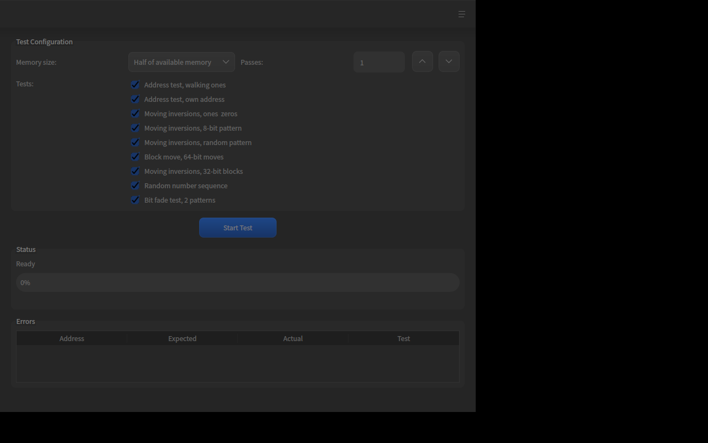

# memtest86 (deepin 25)

内存诊断工具，灵感来自 memtest86。用于在 deepin 25 系统中测试内存稳定性，
支持 CLI 和图形界面（DTK）两种模式，界面语言自动跟随系统（中文 / English）。

A memory diagnostic tool inspired by memtest86 for deepin 25.
Supports both CLI and DTK GUI modes; UI language follows the system locale
(中文 / English).

## 功能 / Features

- 9 种测试算法（参考 memtest86）：
  - Test 0: 地址测试，走查 1 位 / Address test, walking ones
  - Test 1: 地址测试，自身地址 / Address test, own address
  - Test 2: 移动反转，全 1 与全 0 / Moving inversions, ones & zeros
  - Test 3: 移动反转，8 位模式 / Moving inversions, 8-bit pattern
  - Test 4: 移动反转，随机模式 / Moving inversions, random pattern
  - Test 5: 块移动，64 位移动 / Block move, 64-bit moves
  - Test 6: 移动反转，32 位块 / Moving inversions, 32-bit blocks
  - Test 7: 随机数序列 / Random number sequence
  - Test 9: 位衰减测试，2 种模式 / Bit fade test, 2 patterns
- CLI 模式：指定内存大小、轮数、测试项，输出结果
- GUI 模式：DTK6 风格界面，实时进度、错误记录表格
- 中英文自动跟随系统语言（Qt Linguist i18n）
- 自检模式（--self-test）：注入已知故障验证检测逻辑本身
- 位衰减测试支持真实静置延时（--fade-delay），可配置
- 测试缓冲区尝试锁页（mlock）与大页（MADV_HUGEPAGE），防止交换/减少 TLB 抖动
- 随机模式测试使用种子重放，无需等大期望值向量，峰值内存减半

## 构建 / Build

依赖：Qt6 (Core/Gui/Widgets)、DTK6 (DtkWidget)、CMake ≥ 3.16、g++ ≥ 11

```bash
cmake -B build -S . -DCMAKE_BUILD_TYPE=Release
cmake --build build -j$(nproc)
```

## 使用 / Usage

### GUI（默认）

```bash
./build/memtest86
```

### CLI

```bash
# 全部测试，默认内存大小
./build/memtest86 --cli

# 指定 512 MiB，2 轮
./build/memtest86 --cli -s 512M -p 2

# 只跑测试 0 和 2
./build/memtest86 --cli -t 0,2 -s 256M

# 位衰减测试静置 10 秒（检测电荷泄漏）
./build/memtest86 --cli -t 9 --fade-delay 10000

# 自检：注入已知故障并验证检测逻辑
./build/memtest86 --cli --self-test

# 详细输出
./build/memtest86 --cli -v
```

参数 / Options:

| 参数 | 说明 |
|------|------|
| `--cli` | 命令行模式（默认 GUI） |
| `-s, --size <size>` | 测试内存大小，如 256M / 1G / 512K（默认可用内存一半） |
| `-p, --passes <n>` | 测试轮数（默认 1） |
| `-t, --tests <list>` | 逗号分隔测试编号（默认全部） |
| `--fade-delay <ms>` | 位衰减测试写入与校验之间的静置时间（默认 1000 ms） |
| `--self-test` | 自检：注入已知故障并验证检测逻辑工作正常 |
| `-v, --verbose` | 详细输出 |
| `-h, --help` | 帮助 |

## 安装 / Install

```bash
cmake --install build --prefix /usr
```

会安装可执行文件、翻译文件（/usr/share/memtest86/translations）和桌面入口。

## 构建 deb 包 / Build deb package

项目根目录已包含 `debian/` 打包目录（基于 debhelper 13 + CMake），可直接构建：

```bash
# 安装构建依赖
sudo apt build-dep .

# 构建二进制 deb 包（不签名）
dpkg-buildpackage -b -us -uc
```

产物在上级目录：`memtest86_1.0.0-1_amd64.deb`（含 dbgsym 调试包）。

包内容：
- `/usr/bin/memtest86` — 可执行程序
- `/usr/share/applications/memtest86.desktop` — 桌面入口
- `/usr/share/man/man1/memtest86.1.gz` — 手册页
- `/usr/share/memtest86/translations/` — 中英文翻译
- `/usr/share/doc/memtest86/` — 版权与变更日志

安装验证：

```bash
sudo dpkg -i ../memtest86_1.0.0-1_amd64.deb
```

## 截图 / Screenshots

中文界面：



English UI:



## License

GPL-2.0-or-later
